# Profile Zome Demo: A Comprehensive Guide

Welcome to the Profile Zome Demo! This document provides a detailed walkthrough of the `profiles` zome, showcasing how agents interact within the Holochain network and how profiles are created, viewed, and edited.

## Introduction to the Holochain Playground

The Holochain Playground is a powerful tool for visualizing agents and their interactions within the network. Each entry in the Distributed Hash Table (DHT) is accompanied by a header, which can be of type `Create`, `Update`, or `Delete`. In our demo, we'll explore the interactions of two agents within the network.

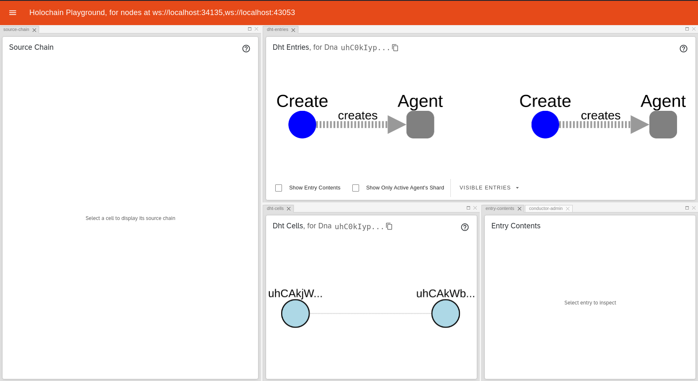

### Agent Initialization

When an agent is initialized, it creates an `Agent` entry in its source chain and on the DHT. This entry represents the Agent's Public Key.

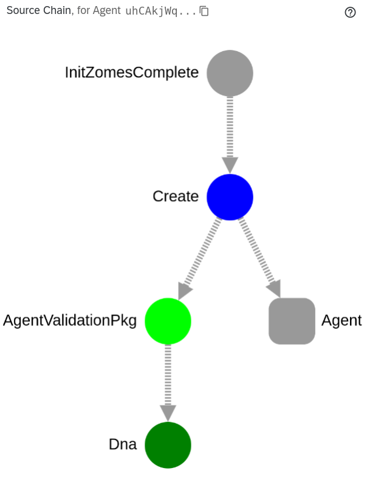

It's an entry that represents the Agent Public Key.

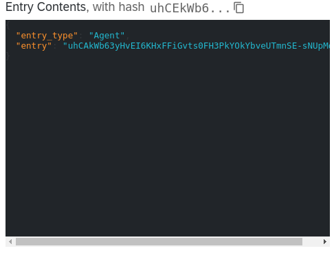

## Creating a Profile: Step-by-Step Guide

### 1. Home Page Overview

The app home page will search in the source chain for any profiles. If there are no profiles, the app will suggest to create one.

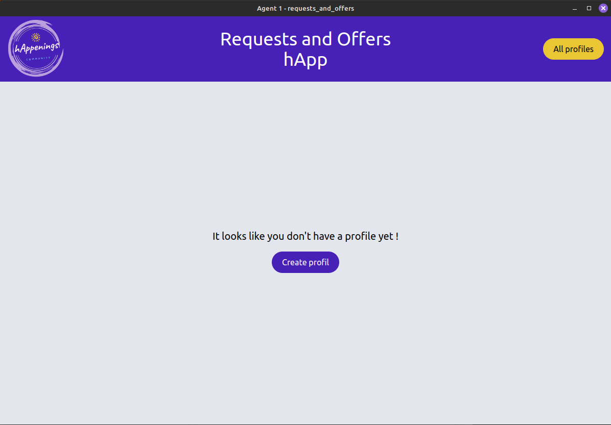

### 2. Profile Creation Form

The create profile form display all the fields to create a profile. The required ones are `name`, `nickname`, `user_type`, and `email`.

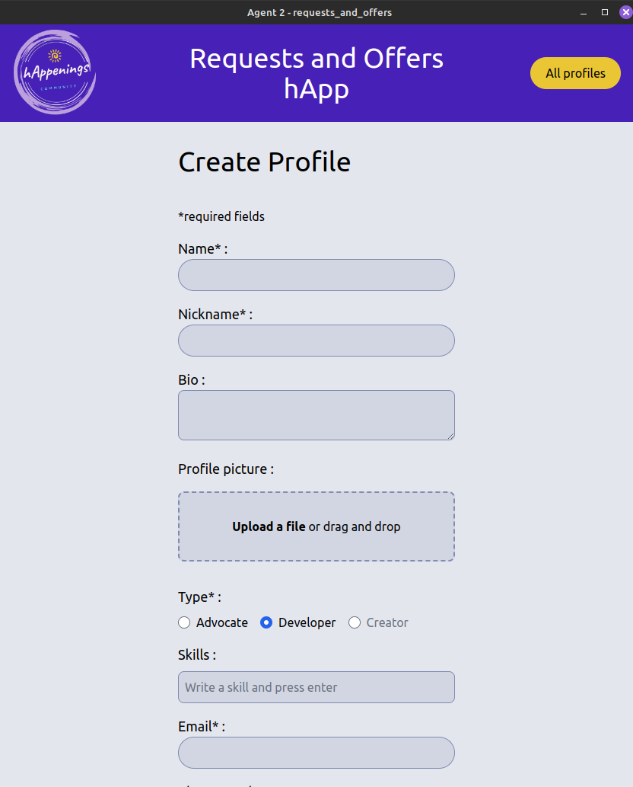

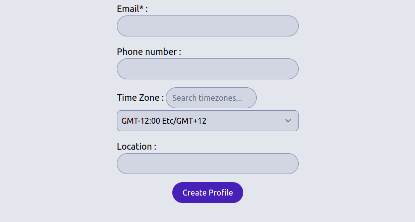

### 3. Profile Picture Upload

When a profile picture is uploaded, the app will display its file name, thumbnail, and propose to remove it.

### 4. Profile Type Selection

The profile type must be one of `developer` or `advocate`. I added `creator` as a suggestion because maybe it could be needed for users that don't want to create offers. (Like project managers or recruiters)

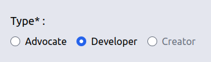

### 5. Viewing Profiles

Once the profile is created, the user is redirected to the profile page. The app will display all the profile fields.

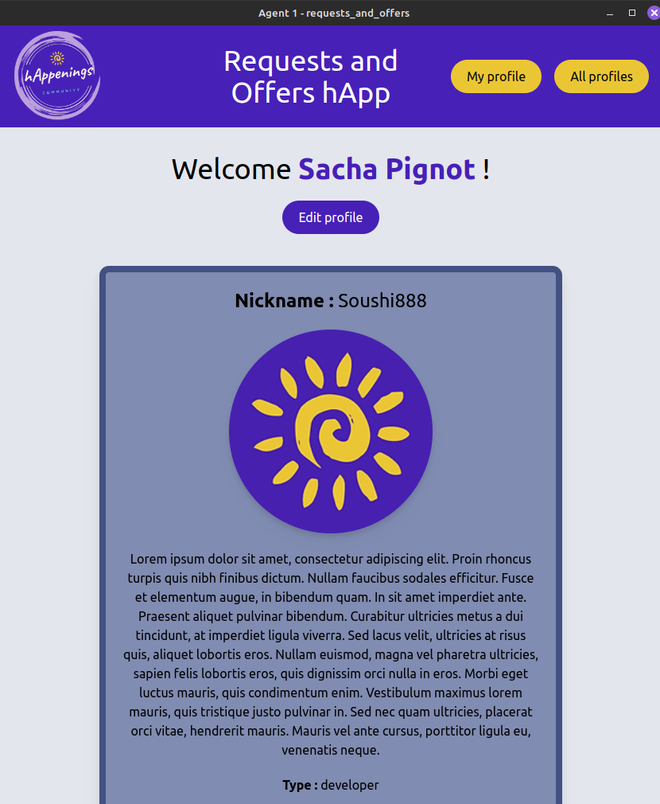

In the Holochain Playground, we can see that a new entry is added and linked to the agent.

`Zome:0,EntryId:0` is the representation of the profile entry.

### 6. All Profiles Page

In the all profiles page, the app will display all the profiles.

### 7. Viewing Individual Profiles

When the user clicks on the View button, the app will display the profile in a modal.

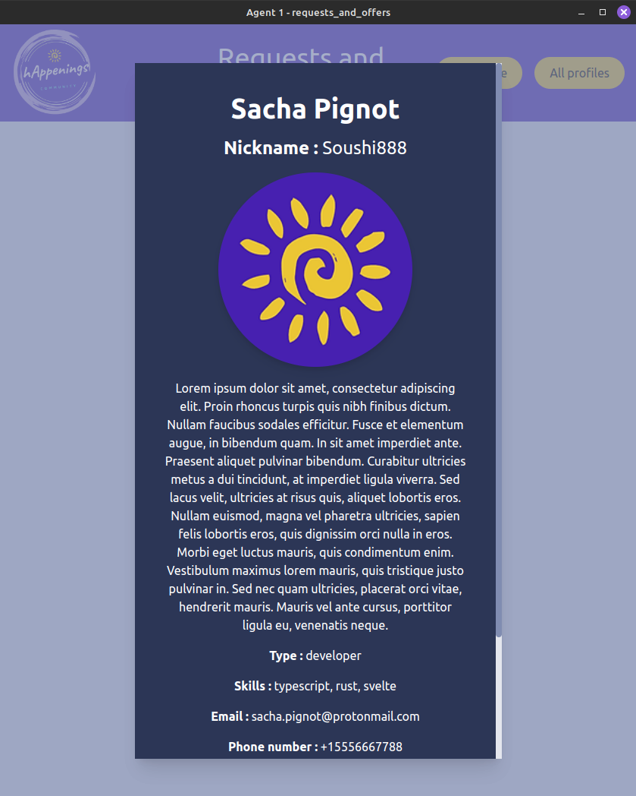

### 8. Creating a Profile for the Second Agent

Let's create a profile for the second agent. Now we have 2 profiles in the All profiles page.

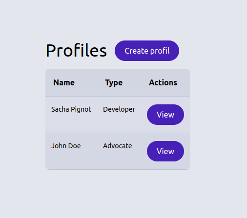

### 9. Holochain Playground with 2 Created Profiles

In the holochain playground, we can see that a new entry is added and linked to the second agent.

The `unknown` node is the `All_profiles` anchor that is an index of all the profiles.

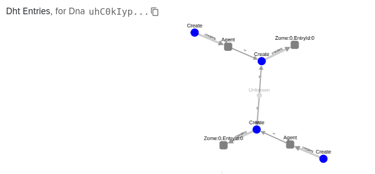

## Editing a Profile: A Guide

### 1. Accessing the Edit Profile Form

On the `My profile` page, there's an `Edit profile` button. It redirects to the edit profile form.

The form is already filled with the profile information.

### 2. Making Changes

For example, let remove the profile picture. It will be replaced by the default one.

### 3. Understanding Updates in the Holochain Playground

In the Holochain playground, we can see that the entry is updated.

The update header point to the `Create` header of the updated profile entry. Each `Update` header has a reference to the previous entry (`Create` or `Update` dependently if its the first update) AND to the original `Create` header.

### 4. Reverting Changes

Let's try to update again the first agent profile and give him back its original profile picture. Now its profile is the same as the original.

Because the DHT is content addressable, the new update will be linked to the previous profile entry, because it already exists. It's particularly useful for avoiding useless duplicates.

The new `Update` header point to the `Create` header of the original profile entry and to the `Update` header of the previous profile. It creates an Update chain that is an tamperproof history of the updates.

### 5. Final Update

For the end, we can update the profile of the second agent and see how the playground changes.

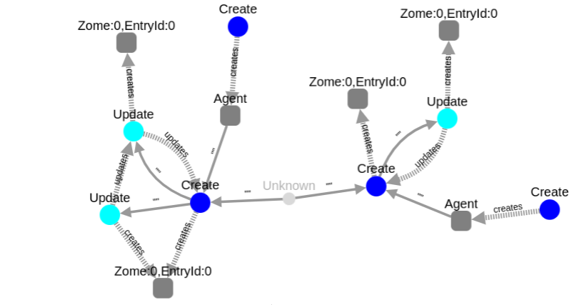

## Conclusion

This demo has provided a comprehensive overview of the `profiles` zome, including agent initialization, profile creation, and editing. By following these steps, you've gained insight into how profiles are managed within the Holochain network.