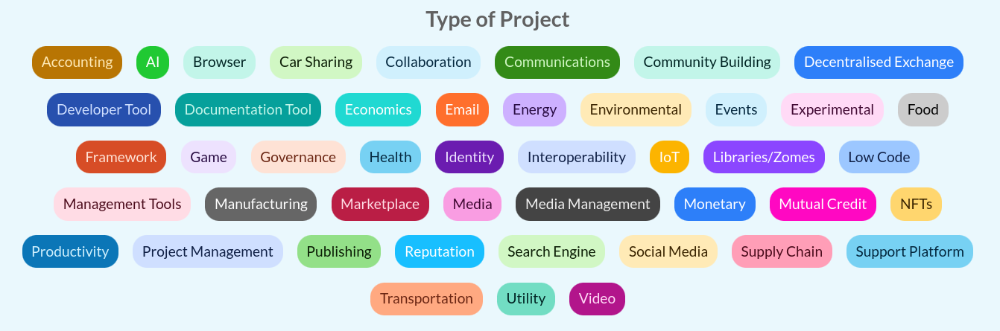

# Requests & Offers - HC/MVP Specification Document

## 1. Introduction

The Requests & Offers - HC/MVP project aims to develop a Holochain application designed to facilitate the exchange of requests and offers within the hAppenings.community. This document outlines the specifications and requirements for the development of this application, focusing on its core functionalities, technologies, and user interactions.

## 2. Objective

The primary objective of this project is to create a simple, open-source Holochain application that enables Creators, Projects, and Developers to reach out to Holochain Advocates with specific requests for support. The application will be built on Holochain, incorporating TimeBanking and Local Exchange Trading System (LETS) design ideas and potentially including a Mutual Credit Currency component in post MVP versions.

## 3. Targeted Audience

This application is specifically tailored for the participants in the Holochain Ecosystem. At hAppenings.community, we have created our own definitions of the individuals who would be participants in Requests & Offers - HC/MVP. The targeted audience includes:

- **Holochain Creators/Projects/Developers**: Individuals or groups actively involved in creating or developing projects within the Holochain ecosystem.
- **Holochain Advocates**: Individuals passionate about the Holochain technology, looking to support projects within the ecosystem.
- **HoloHosts**: Organizations or individuals hosting Holochain nodes, contributing to the network's infrastructure.

## 4. Core Features

### 4.1 User Persons

- **Person Creation**: Users can create and retrieve their persons, categorized as "advocate", "developer" or "creator".
- **Person Retrieval**: Users can retrieve their persons on other devices using credentials.
- **Person Linking**: Persons can be linked to agents, organizations, requests, offers, and projects.
- **Custom Holochain Zome**: A custom zome is used for managing user persons within the application.
- **hREA agents**: Persons are linked to hREA agents.

### 4.2 Person Entry

The `Person` entry represents the person and its associated agents within the hAppenings.community. An agent can be a single user or a device associated with a user, allowing for the sharing of persons across multiple devices. This entry includes various fields to capture essential information about the person, facilitating personalized experiences and targeted interactions within the community.

#### 4.2.1 Fields

- **name**: The full name of the person.
  - **Type**: `String`
  - **Validation**: Must not be empty.
- **nickname**: A shorter version of the person's name, often used for display purposes.
  - **Type**: `String`
  - **Validation**: Must not be empty.
- **bio**: A brief biography about the person.
  - **Type**: `String`
  - **Validation**: Optional, but recommended for a richer user experience.
- **picture**: An optional serialized image representing the person's picture.
  - **Type**: `Option<SerializedBytes>`
  - **Validation**: Optional, but if provided, must be a valid image.
- **type**: The type of person, either 'advocate', 'developer' or 'creator'.
  - **Type**: `String`
  - **Validation**: Must be either 'advocate', 'developer' pr 'creator'.
- **skills**: A list of skills EntryHash associated with the person.
  - **Type**: `Vec<EntryHash>`
  - **Validation**: Optional, can be initially empty.
- **email**: The person's email address.
  - **Type**: `String`
  - **Validation**: Must be a valid email address format.
- **urls**: A list of URLs associated with the person.
  - **Type**: `Vec<String>`
  - **Validation**: Optional, but recommended for community engagement and networking.
  - **Default**: Empty
- **phone**: An optional phone number for the person.
  - **Type**: `Option<String>`
  - **Validation**: Optional, but if provided, must be a valid phone number format.
- **time_zone**: The time zone in which the person resides.
  - **Type**: `String`
  - **Validation**: Must be a valid time zone identifier.
- **location**: The location where the person is based.
  - **Type**: `String`
  - **Validation**: Optional, but recommended for community engagement and networking.
- **status**: The status of the person, either 'pending', 'accepted', or 'rejected'.
  - **Type**: `String`
  - **Validation**: Must be either 'pending', 'accepted', or 'rejected'.

#### 4.2.2 Links

  - **PersonUpdates**: A link from the person create header to the person update headers.
  - **PersonAgents**: A link from the person to an agent. It is an index of all the agents that have the person.
  - **AllPersons**: A link to the `persons` anchor. It is an index of all the persons.
  - **MyPerson**: A link from the current agent to the person.
  - **PersonRequests**: A link from the person to a request. It is an index of all the requests that have the person.
  - **PersonOffers**: A link from the person to an offer. It is an index of all the offers that have the person.
  - **PersonProjects**: A link from the person to a project. It is an index of all the projects that have the person.
  - **PersonOrganizations**: A link from the person to an organization. It is an index of all the organizations that have the person.
  - **PersonSkills**: A link from the person to a skill. It is an index of all the skills that have the person.
  
### 4.3 Projects and Organizations

- **Project and Organization Creation**: Users can create projects and organizations, with projects owned by organizations. Projects have specific requirements and status.
![Project status](images/project-stat  - **AdministratorsPerson**: A link from the `administrators` anchor to the person. It is an index of all the administrators of the network.

The `Project` entry represents a project and its associated agents, including team members. Projects have specific requirements and status. Projects can be created by organizations or by persons.

In hREA, projects are organizations `classifiedAs` `Project`.

##### 4.3.1.1 Fields

- **name**: The name of the project.
  - **Type**: `String`
  - **Validation**: Must not be empty.
- **description**: A brief description of the project.
  - **Type**: `Option<String>`
  - **Validation**: Optional, but recommended for community engagement and networking.
  - **Default**: `None`
- **picture**: An optional serialized image representing the project's picture.
  - **Type**: `Option<SerializedBytes>`
  - **Validation**: Optional, but if provided, must be a valid image.
  - **Default**: `None`
- **urls**: A list of URLs associated with the project.
  - **Type**: `Vec<String>`
  - **Validation**: Optional, but recommended for community engagement and networking.
  - **Default**: Empty
- **status**: The status of the project, either 'pending', 'accepted', or 'rejected'.
  - **Type**: `String`
  - **Validation**: Must be either 'pending', 'accepted', or 'rejected'.
  - **Default**: `pending`

##### 4.3.1.2 Links

- **AllProjects**: A link to the `projects` anchor.
- **ProjectAdministrators**: A link from the project's to a person. It is an index of all the administrators.
- **ProjectTeamMembers**: A link from the project's to a person. It is an index of all the team members.
- **ProjectCategories**: A link from the project's to a category. It is an index of all the categories.
- **ProjectRequests**: A link from the project's to a request. It is an index of all the requests made by the project.
- **ProjectOffers**: A link from the project's to an offer. It is an index of all the offers made to the project.

#### 4.3.2 Organization Entry

The `Organization` entry represents an organization and its associated persons and projects. Organizations are created by persons.

In hREA, are agents `classifiedAs` `Organization`.

##### 4.3.2.1 Fields

- **name**: The name of the organization.
  - **Type**: `String`
  - **Validation**: Must not be empty.
- **description**: A brief description of the organization.
  - **Type**: `Option<String>`
  - **Validation**: Optional, but recommended for community engagement and networking.
  - **Default**: `None`
- **picture**: An optional serialized image representing the organization's picture.
  - **Type**: `Option<SerializedBytes>`
  - **Validation**: Optional, but if provided, must be a valid image.
  - **Default**: `None`
- **urls**: A list of URLs associated with the organization.
  - **Type**: `Vec<String>`
  - **Validation**: Optional, but recommended for community engagement and networking.
  - **Default**: Empty
- **status**: The status of the organization, either 'pending', 'accepted', or 'rejected'.
  - **Type**: `String`
  - **Validation**: Must be either 'pending', 'accepted', or 'rejected'.
  - **Default**: `pending`

##### 4.3.2.2 Links

- **AllOrganizations**: A link to the `organizations` anchor.
- **OrganizationAdministrators**: A link from the organization's to a person. It is an index of all the administrators of the organization.
- **OrganizationMembers**: A link from the organization's to a person. It is an index of all the members of the organization.
- **OrganizationProjects**: A link from the organization's to a project. It is an index of all the projects under the organization.
- **OrganizationCategories**: A link from the organization's to a category. It is an index of all the categories under the organization.
- **OrganizationRequests**: A link from the organization's to a request. It is an index of all the requests made by the organization.
- **OrganizationOffers**: A link from the organization's to an offer. It is an index of all the offers made to the organization.

### 4.4 Requests and Offers

- **hREA Integration**: Utilizes hREA for managing economic activities, including tracking resources, facilitating agreements, and matching needs.
- **Request Creation**: Users can create requests, linked to specific projects, organizations and skills.
- **Offer Creation**: Organizations, projects and users can create offers, linked to specific requests and projects.
- In hREA, requests and offers are `intents` and `proposals`.

### 4.5 Skills and Categories

- **Skills**: Users can create skills, which are used to filter agents persons, requests and offers.
- **Categories**: Administrators can create categories, which are used to organize projects, requests and offers.

#### 4.5.1 Skill Entry

The `Skill` entry represents the skills associated with the persons, projects, requests and offers. This in an anchor that contains a `String` that is the skill name.

In hREA, skills are Resource Specifications. They can be created only by offers and requests. A user need to create an offer that is the list of its skills to be able to display it in its profile.

#### 4.5.1.1 Links

- **AllSkills**: A link to the `skills` anchor. It is an index of all the skills.
- **SkillPersons**: A link from the skill to a person. It is an index of all the persons that have the skill.
- **SkillProjects**: A link from the skill to a project. It is an index of all the projects that have the skill.
- **SkillRequests**: A link from the skill to a request. It is an index of all the requests that have the skill.
- **SkillOffers**: A link from the skill to an offer. It is an index of all the offers that have the skill.

#### 4.5.2 Category Entry

The `Category` entry represents the categories associated with projects and offers. This in an anchor that contains a `String` that is the category name. 

The `Category` of an organization is the collection of the `Category` of its projects.

In hREA, categories are Resource Specifications `classifiedAs` `{category}`.

#### 4.5.2.1 Links

- **AllCategories**: A link to the `categories` anchor. It is an index of all the categories.
- **CategoryProjects**: A link from the category to a project. It is an index of all the projects that have the category.
- **CategoryOffers**: A link from the category to an offer. It is an index of all the offers related to the category.

### 4.6 Search Functionality

Each page has a search functionality.

- **Search Persons**: Users can search persons by name, skills, categories, location, organizations and projects.
- **Search Organizations**: Users can search organizations by name, categories, projects.
- **Search Projects**: Users can search projects by name, skills, categories and organizations.
- **Search Requests**: Users can search requests by name, skills, categories, projects, organizations and persons.
- **Search Offers**: Users can search offers by name, skills, categories, projects, organizations and persons.

### 4.7 Administrator and Moderation Functionalities

Administrators play a crucial role in managing the network's operations, ensuring its smooth functioning and security. Their responsibilities encompass:

- **Managing Requests and Offers**: Administrators oversee the creation, modification, and resolution of requests and offers within the network.
- **Project and Organization Management**: They are responsible for the creation, approval, and management of projects and organizations, ensuring they align with the network's standards and objectives.
- **Agent Management**: This includes the manual verification of persons profiles ensuring their authenticity and compliance with the network's guidelines.

Key points regarding administrator roles and access include:

- **Initial Network Initiator**: The first agent to initiate the network is designated as an administrator, setting the foundation for the network's governance.
- **Special Access**: Administrators are granted exclusive access to the `Administration` zome and UI, enabling them to perform their duties effectively.
- **Utilization of hREA Roles**: Administrators leverage hREA roles to manage projects and organizations, ensuring a structured and efficient approach to resource allocation and project coordination.
- **Capability-Based Security**: The network employs capability-based Holochain security measures, ensuring that only authorized administrators can access and modify critical functions, thereby safeguarding the network against unauthorized use.

#### 4.7.1 Links

- **AdministratorsPerson**: A link from the `administrators` anchor to a person. It is an index of all the administrators of the network.

## 5. MVP Use Case: Project Collaboration and Skill Matching

### 5.1 User Registration and Person profile

- **Use Case**: Users can register and create person profile.
- **Benefit**: Facilitates the creation of a user-centric community, enabling personalized experiences and targeted interactions.

### 5.1.1 Person Retrieval

- **Use Case**: Users can retrieve their person profile, including their skills, projects, organizations, requests and offers.
- **Benefit**: Facilitates the creation of a user-centric community, enabling personalized experiences and targeted interactions. It allows the user to link multiple agents/devices to their person profile.

### 5.2 Project Creation

- **Use Case**: Users can create projects, specifying the skills needed and the scope of the project.
- **Benefit**: Allows for the organization and management of projects, ensuring that the right skills are matched with the right projects.

### 5.3 Request Creation

- **Use Case**: Users can create requests for specific skills or resources needed for their projects. These requests can be linked to specific projects, organizations, skills, and team members.
- **Benefit**: Provides a structured way for users to express their needs, ensuring that the right offers are matched with their requests. This functionality supports the efficient allocation of resources and skills within the community.

### 5.4 Offer Creation

- **Use Case**: Users with relevant skills can create offers to contribute to projects, specifying the skills they are offering and how they intend to contribute.
- **Benefit**: Enables direct matching of skills with project needs, facilitating efficient collaboration.

### 5.5 Request and Offer Management

- **Use Case**: Users can manage their requests and offers, including accepting offers from other users.
- **Benefit**: Provides a structured way for users to engage with each other, ensuring that interactions are organized and manageable.

### 5.6 Basic Search Functionality

- **Use Case**: Users can search for requests, offers, projects, organizations, persons by name, skills, categories, organizations and projects.
- **Benefit**: Enhances the discoverability of resources within the community, promoting collaboration and innovation.

## 6. Infrastructure

### 6.1 Holo Hosting

- **Holo Hosting Overview**: Leverages HoloHosts for robust and scalable infrastructure, contributing to the network's infrastructure and enhancing performance and reliability.
- **Hosting Requirements**: Requires a distributed network of HoloHosts for high availability and redundancy. The Holo Network can supply multiple HoloHosts for redundancy.
- **Hosting Benefits**: Fosters a decentralized and resilient infrastructure, aligning with Holochain ecosystem principles.

## 7. Technologies

- **Holochain**: Core technology for building the application, ensuring local-first and peer-to-peer network capabilities.
- **SvelteKit**: Utilized for the guest/front-end, providing a modern and efficient framework for web development.
  - **Skeleton UI**: A component library for building user interfaces with SvelteKit and Tailwind. 
- **hREA**: hREA (Holochain Resource-Event-Agent) is an implementation of the Valueflows specification. It enables a transparent and trusted account of resource and information flows between decentralized and independent agents, across and within ecosystems.

## 8. User Interface

Color palette :

## 9. Conclusion

This specification document outlines the key components and functionalities of the Requests & Offers - HC/MVP project. By adhering to these specifications, developers can ensure the successful creation of a Holochain application that effectively facilitates the exchange of requests and offers within the hAppenings.community.
