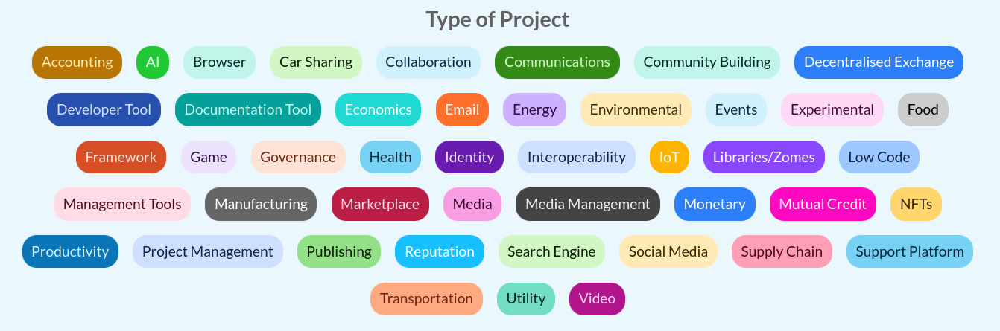

# Detailed Feature Specifications

## 1. User Management

### 1.1 User Profile
- Creation and authentication of user profiles
- Profile categorization as "advocate" or "creator"
- Multi-device profile access using credentials
- Integration with hREA agents
- Custom Holochain zome for profile management

### 1.2 Profile Links
Users can be linked to:
- Agents
- Organizations
- Requests
- Offers
- Projects
- Skills

### 1.3 User Entry Structure
The `User` entry represents profiles within hAppenings.community, supporting:
- Single user profiles
- Multi-device profile sharing
- Personalized experiences
- Community interactions

#### Links
- **UserUpdates**: User create header → update headers
- **UserAgents**: User → agent (index of associated agents)
- **AllUsers**: Link to `users` anchor (global user index)
- **MyUser**: Current agent → user
- **UserRequests**: User → requests (index)
- **UserOffers**: User → offers (index)
- **UserProjects**: User → projects (index)
- **UserOrganizations**: User → organizations (index)
- **UserSkills**: User → skills (index)

## 2. Projects and Organizations

### 2.1 Projects
Projects are organizations `classifiedAs` `Project` in hREA.

#### Project Features
- Creation by organizations or users
- Specific requirements and status tracking
- Team member management
- Category classification

#### Project Status Flow

#### Project Types

#### Project Links
- **AllProjects**: Link to `projects` anchor
- **ProjectCoordinators**: Project → coordinators
- **ProjectContributors**: Project → contributors
- **ProjectCategories**: Project → categories
- **ProjectRequests**: Project → requests
- **ProjectOffers**: Project → offers

### 2.2 Organizations
Organizations are agents `classifiedAs` `Organization` in hREA.

#### Organization Features
- User-created entities
- Project management capabilities
- Member management
- Category classification

#### Organization Links
- **AllOrganizations**: Link to `organizations` anchor
- **OrganizationCoordinators**: Organization → coordinators
- **OrganizationMembers**: Organization → members
- **OrganizationProjects**: Organization → projects
- **OrganizationCategories**: Organization → categories
- **OrganizationRequests**: Organization → requests
- **OrganizationOffers**: Organization → offers

### 2.3 Coordinator Management

#### Responsibilities
- Project/Organization representation
- Organization/Project profile management
- Member invitation and approval
- Request/Offer management on behalf of the organization/project

#### Features
- Network administrator approval required
- Organization/Project profile customization (description, type, skills needed, etc.)
- Request/Offer creation capabilities for the organization/project
- Member invitation and approval management

## 3. Requests and Offers

### 3.1 Core Functionality
- hREA integration for economic activities
- Request creation linked to projects/organizations/skills
- Offer creation linked to requests/projects
- Implementation as hREA `intents` and `proposals`

### 3.2 Exchange Completion
- Bilateral confirmation mechanism
- In-app completion verification
- Exchange finalization process

### 3.2 Types of Support Requested

## 4. Skills and Categories

### 4.1 Skills
Skills are implemented as Resource Specifications in hREA.

#### Skill Features
- Created through offers
- User profile integration
- Project/Request/Offer association

#### Skill Links
- **AllSkills**: Global skills index
- **SkillUsers**: Skill → users
- **SkillProjects**: Skill → projects
- **SkillRequests**: Skill → requests
- **SkillOffers**: Skill → offers

### 4.2 Categories
Categories are Resource Specifications `classifiedAs` `{category}` in hREA.

#### Category Features
- Administrator-created
- Project organization
- Offer classification
- Organization categorization

#### Category Links
- **AllCategories**: Global category index
- **CategoryProjects**: Category → projects
- **CategoryOffers**: Category → offers

### 4.5 Reporting Features

#### User Reports
- Personal exchange history
- Monthly activity summaries
- Project contribution tracking
- Skills utilization metrics

#### Administrative Reports
- Network activity metrics
- User verification status
- Project status tracking
- Exchange completion rates
- Moderation action logs

## 5. Search Functionality

### 5.1 Search Capabilities
Each major section includes search functionality:

#### User Search
- Name
- Skills
- Categories
- Location
- Organizations
- Projects

#### Project Search
- Name
- Category
- Organization
- Status
- Skills required

#### Organization Search
- Name
- Category
- Members
- Projects

#### Request/Offer Search
- Type
- Category
- Skills
- Status
- Associated project/organization

## 6. Network Administration

### 6.1 Core Administrative Features
- User and Organization verification
- Project verification
- Moderator role management
- Suspension system
- Flagging system
- Administrative inbox

### 6.2 User Interface
- Administration Dashboard
- User management interface
- Project/Organization management
- Request/Offer moderation
- Search and reporting tools

## 7. Communication and Negotiation

### 7.1 Messaging System
- **User-to-User Messaging**: Allows users to communicate directly with one another, facilitating negotiations and discussions related to requests and offers.
- **Administrative Communication**: Provides a channel for users to send messages to network administrators through an inbox within the administration panel.
- **Features**:
  - Direct messaging between users
  - Negotiation support for requests/offers
  - Administrative communication channel
  - Message history tracking
  - Agreement finalization support

### 7.2 Notification System
- **Suspension Notifications**: Users receive notifications about account suspension status and reasons
- **Exchange Updates**: Notifications for request/offer matches and updates
- **Administrative Alerts**: Important system and moderation notifications
- **Recovery Notifications**: Updates about account recovery process
