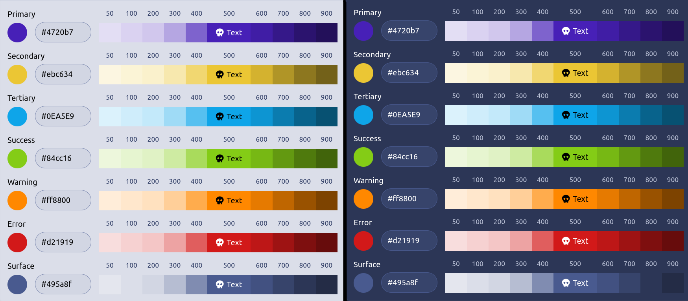
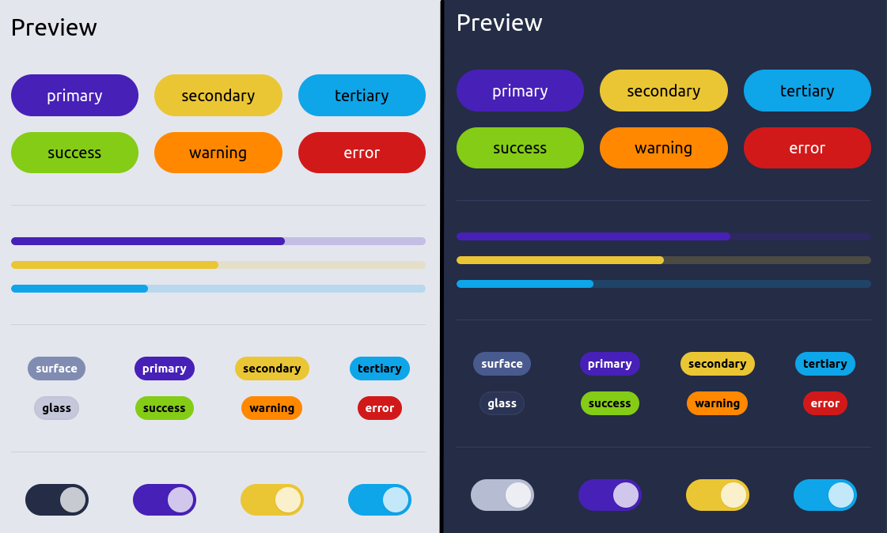
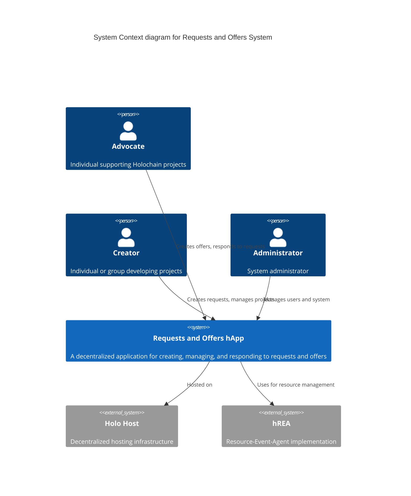
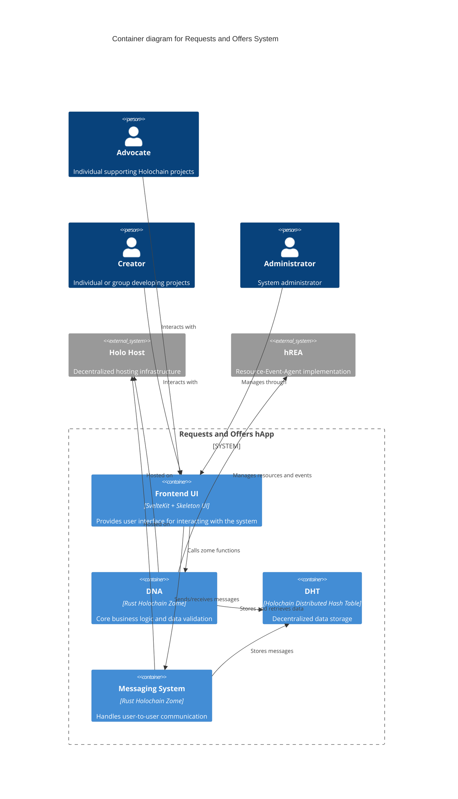
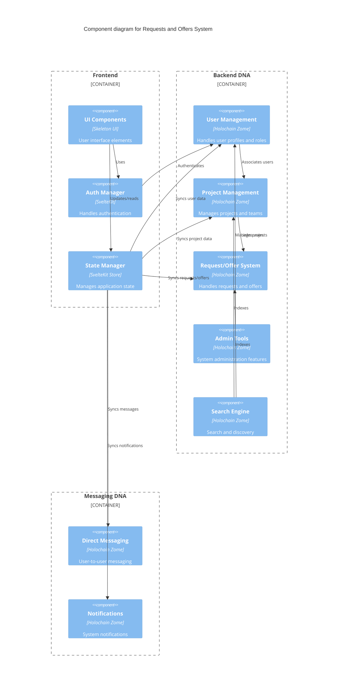
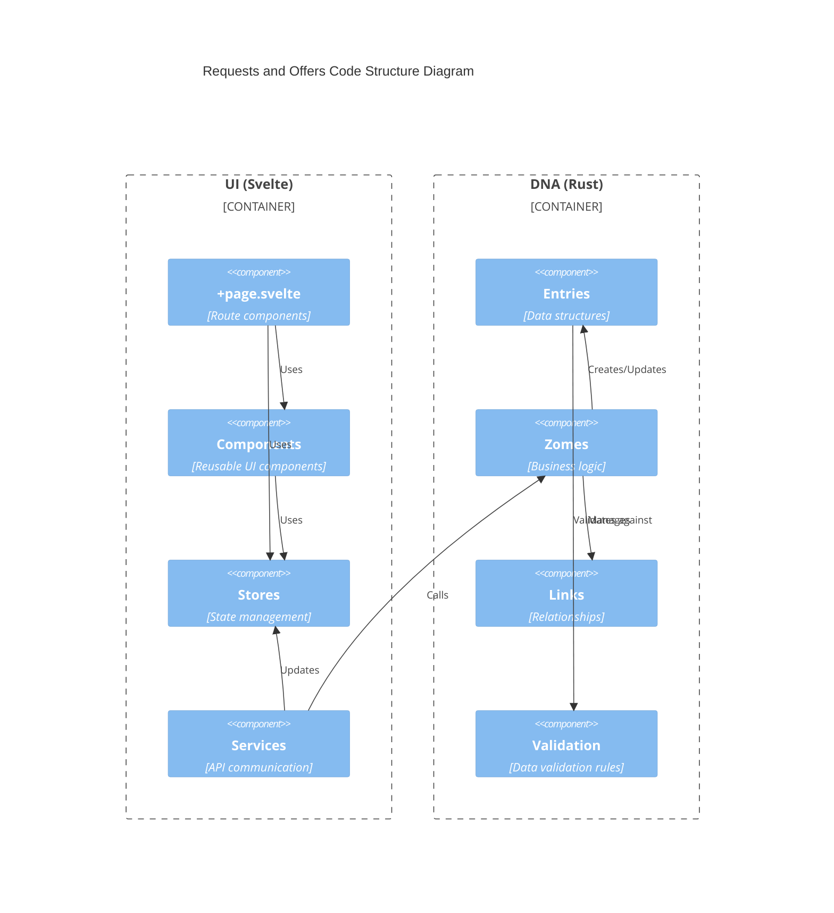

# Technical Specifications

## 1. Infrastructure

### 1.1 Holo Hosting

- **Holo Hosting Overview**: Leverages HoloHosts for robust and scalable infrastructure, contributing to the network's infrastructure and enhancing performance and reliability.
- **Hosting Requirements**: Requires a distributed network of HoloHosts for high availability and redundancy. The Holo Network can supply multiple HoloHosts for redundancy.
- **Hosting Benefits**: Fosters a decentralized and resilient infrastructure, aligning with Holochain ecosystem principles.

## 2. Technologies

### 2.1 Core Technologies

- **Holochain**: Core technology for building the application, ensuring local-first and peer-to-peer network capabilities.
- **SvelteKit**: Utilized for the guest/front-end, providing a modern and efficient framework for web development.
  - **Skeleton UI**: A component library for building user interfaces with SvelteKit and Tailwind. 
- **hREA**: hREA (Holochain Resource-Event-Agent) is an implementation of the Valueflows specification. It enables a transparent and trusted account of resource and information flows between decentralized and independent agents, across and within ecosystems.
  - For detailed hREA integration specifications, see [hREA Integration](../technical/architecture/hrea-integration.md)

### 2.2 Communication Systems

#### Messaging System
- User-to-User Messaging
- Administrator Communication Channel
- Notification System for Suspensions

#### Real-time Features
- Direct messaging capabilities
- Negotiation support
- Agreement finalization
- Status updates
- Exchange notifications

### 2.3 Security Features

- User Authentication
- Profile Recovery System
- Administrator Access Controls
- Suspension Management

### 2.4 Data Management

#### Link Types
- **User Links**: Profile updates, agent associations, requests/offers
- **Project Links**: Coordinators, contributors, categories
- **Organization Links**: Members, projects, categories
- **Skill Links**: Users, projects, requests/offers
- **Category Links**: Projects, offers, organizations

#### Anchor System
- **Administrators Anchor**: Index of network administrators
- **Moderators Anchor**: Index of network moderators
- **Users Anchor**: Global user index
- **Projects Anchor**: Global project index
- **Organizations Anchor**: Global organization index

## 3. User Interface

### 3.1 Design System

Color palette:

### 3.2 Key Interfaces

- User Dashboard
- Project Management Interface
- Request/Offer Management
- Administration Dashboard
- Search Interface
- Messaging Interface

### 3.3 Administrative Interface

- User Management
- Project Verification
- Organization Management
- Request/Offer Moderation
- Reporting Tools

## 4. System Architecture

The system architecture is documented using the C4 model, which provides different levels of abstraction to understand the system structure.

### 4.1 System Context

The following diagram shows the high-level system context and key user roles:

### 4.2 Container Structure

The container diagram shows the high-level technical building blocks:

### 4.3 Component Structure

The component diagram details the internal structure of each container:

### 4.4 Code Structure

The code structure diagram shows the organization of the codebase:

### 4.5 Architecture Principles

1. **Decentralization**: The system leverages Holochain's peer-to-peer architecture to ensure:
   - Data sovereignty
   - Resilient infrastructure
   - No single point of failure

2. **Modularity**: The system is built with clear separation of concerns:
   - Frontend (SvelteKit + Skeleton UI)
   - Backend DNA (Holochain Zomes)
   - Messaging DNA
   - Data storage (DHT)

3. **Security**: Built-in security features:
   - User authentication
   - Role-based access control
   - Data validation
   - Secure messaging

4. **Scalability**: The system is designed to scale through:
   - Distributed hosting
   - Efficient data structures
   - Modular components
